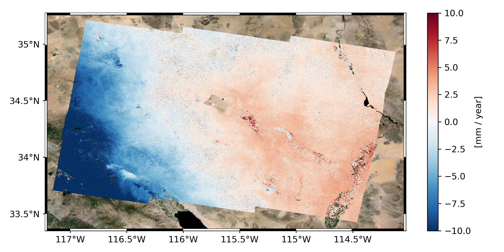

# Summary

<!-- JOSS welcomes submissions from broadly diverse research areas. For this reason, we require that authors include in the paper some sentences that explain the software functionality and domain of use to a non-specialist reader. We also require that authors explain the research applications of the software. The paper should be between 250-1000 words. Authors submitting papers significantly longer than 1000 words may be asked to reduce the length of their paper. -->

<!-- A summary describing the high-level functionality and purpose of the software for a diverse, non-specialist audience. -->

`dolphin` is a Python library for creating maps of land surface displacement using the remote sensing technique called Interferometric Synthetic Aperture Radar (InSAR). Conventional InSAR uses pairs of SAR images to get a single map of the relative displacement between the two acquisition times. Since conventional techniques are prone to multiple noise sources, `dolphin` uses state-of-the-art multi-temporal algorithms to produce long time series of displacement at fine resolution.

# Statement of need
<!-- A Statement of need section that clearly illustrates the research purpose of the software and places it in the context of related work. -->

The Sentinel-1 satellite from the European Space Agency (ESA) has provided free and open access to Synthetic Aperture Radar (SAR) data since 2014. This has led to a rapid increase in the availability of SAR data and has enabled a wide range of applications in Earth and environmental sciences. InSAR has been used to study a wide range of geophysical processes, including earthquakes, volcanic activity, and land subsidence. However, processing InSAR data can be challenging, particularly for large-scale time series analysis, and many existing tools are not designed to run at continental scale in a cloud computing environment.

<!-- A list of key references, including to other software addressing related needs. Note that the references should include full names of venues, e.g., journals and conferences, not abbreviations only understood in the context of a specific discipline. -->
While phase linking algorithms have been known for over a decade [@Guarnieri2008ExploitationTargetStatistics], until several years ago, there were no open source libraries which could perform combined persistent scatterer (PS) and distributed scatterer (DS) processing techniques known as phase linking. Since [@Ferretti2011NewAlgorithmProcessing] and [@Ansari2018EfficientPhaseEstimation] were not made public, the [`FRInGE`](https://github.com/isce-framework/fringe) library was created as a proof of concept for multiple phase linking algorithms [@Fattahi2019]. `FRInGE` is a C++ library with Cython bindings to call workflows from Python. Expanding upon these algorithms,  the [`Miaplpy`](https://github.com/insarlab/MiaplPy) library is a Python library which implements the phase linking algorithms in `FRInGE`, as well as new algorithms outlined in [@Mirzaee2023NonlinearPhaseLinking]. The MATLAB libary [`TomoSAR`](https://github.com/DinhHoTongMinh/TomoSAR) was also made public in 2022 which implements the "Compressed SAR" (ComSAR) algorithm outlined in [@HoTongMinh2022CompressedSARInterferometry].

`dolphin` has been developed as part of the InSAR Scientific computing environment (ISCE) organization to be used in the Observational Products for End-Users from Remote Sensing Analysis (OPERA) project.
OPERA is a Jet Propulsion Laboratory project funded by the Satellite Needs Working Group (SNWG) tasked with generating a North America Displacement product. The displacement product, covering over 10 million square kilometers of land, has a required latency of < 72 hours; as such, new software was required which could handle the heavy computational demands of the project.

# Overview of Dolphin

`dolphin` has the ability to process stacks of coregistered single-look complex (SLC) radar images into a time series of surface displacement and an average surface velocity over the input time period. The software has pre-made workflows accessible through command line tools which call core InSAR algorithm modules from the core library.
The software uses

Figure \autoref{fig:mojave} shows an example output created 4 years of Sentinel-1 data over the Mojave Desert.

<!-- The core library is modular and extensible, allowing easy integration of new algorithms and methods. -->

The command line tools are user-friendly and provide a simple interface for processing large sets (hundreds of SAR images) with minimal required configuration.

While `dolphin` is written in Python, it leverages the `jax` library [@Bradbury2018JAXComposableTransformations] to accelerate linear algebra operations. With only an extra installation, users can accelerate processing speeds by 5-20x on machines with a compatible GPU.

# Acknowledgements

Copyright (c) 2024 California Institute of Technology ("Caltech"). U.S. Government sponsorship acknowledged.

# References
